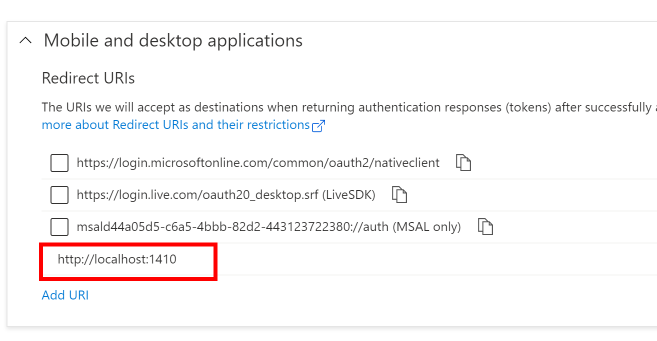
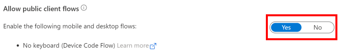
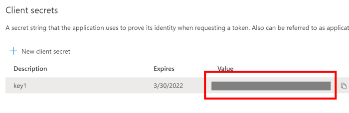

The interaction between app registration configuration and requesting a token can be confusing. This vignette outlines some common authentication scenarios that R users might encounter. For each scenario, we briefly describe the necessary settings for your app registration in Azure, and how to request a token using AzureAuth. The [Azure Active Directory documentation](https://docs.microsoft.com/en-au/azure/active-directory/develop/v2-overview) is the authoritative reference.

## Interactive authentication on a local machine

This is the simplest scenario: you're using R on your local desktop or laptop, and you want to authenticate to Azure with your user credentials.

The authentication flow to use in this case is **authorization_code**. This requires that you have a browser installed on your machine, and it can be called from within R (as is usually the case). You'll also need to have the [httpuv](https://cran.r-project.org/package=httpuv) package: this will be installed if you're a Shiny developer, but otherwise you might have to install it manually.

The code to run in your R session is

```r
library(AzureAuth)

# for an AADv1 token
tok <- get_azure_token("https://resource", tenant="yourtenant", app="yourappid")

# for an AADv2 token
tok <- get_azure_token("https://resource/scope", tenant="yourtenant", app="yourappid", version=2)
```

where `resource[/scope]` is the Azure resource/scope you want a token for, `yourtenant` is your Azure tenant name or GUID, and `yourappid` is your app registration ID. Note that you do _not_ specify your username or password in the `get_azure_token` call.

On the server side, the app registration you use should have a **mobile & desktop redirect** of `http://localhost:1410`. See the crop below of the authentication pane for the app in the Azure portal.




## Interactive authentication in a remote session

This is the scenario where you are using R in a remote terminal session of some kind: RStudio Server, Azure Databricks, or a Linux VM over ssh. Here, you still want to authenticate with your user credentials, but a browser may not be available to use the regular AAD authentication process.

The authentication flow to use is **device_code**. This requires that you have a browser available elsewhere (for example, on the local machine from which you're logged in to your remote session). The code to run in your R session is

```r
tok <- get_azure_token("resource", tenant="yourtenant", app="yourappid", auth_type="device_code")
```

As before, you do _not_ include your username or password in the `get_azure_token` call.

On the server side, the app registration should have the **"Allow public client flows"** setting enabled.



It's possible, and indeed desirable, to combine this with the previous redirect URI in the one app registration. This way, you can use the same app ID to authenticate both locally and in a remote terminal.


## Non-interactive authentication

This is the scenario where you want to authenticate to Azure without a user account present, for example in a deployment pipeline.

The authentication flow to use is **client_credentials**. The code to run looks like

```r
tok <- get_azure_token("resource", tenant="yourtenant", app="yourccappid", password="client_secret")
```

Here, `yourccappid` is the app ID to use for your pipeline; you should not use the same app registration for this purpose as for interactive logins. The `password` argument is the **client secret** for your app registration, and not a user password. See the crop below of the certificates & secrets pane for the app registration. 



Note that in Azure, the client secret is automatically generated by the server and cannot be modified. You can only see it at the time of generation, so make sure you note down its value.

As an alternative to a client secret, it's possible to authenticate using a TLS certificate (public key). This is considered more secure, but is also more complicated to setup. For more information, see the AAD docs linked previously.

